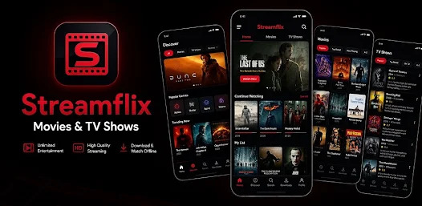
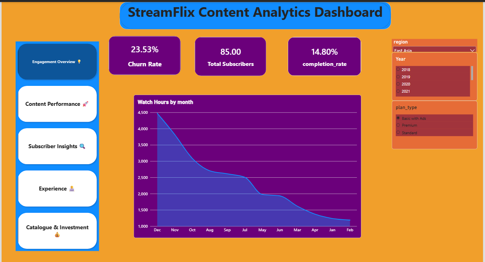

# StreamFlix-Content-Analytics
StreamFlix Content Analytics Project, Part of my Data Analyst Internship at Internmo.

<p align="center">
     
</p>

# Business Problem Statement
StreamFlix is currently unable to optimize its content selection, funding allocation, and subscriber retention strategies. This lack of data-backed decision-making has led to misallocated capital investments, declining revenue, and eroded profit margins. To restore growth and enhance subscriber satisfaction, executive leadership requires actionable, data-driven insights to guide content investments and strategic platform decisions.
# Project Obejctives
- Which genres and titles are driving the most watch time, and which are underperforming? 
- Are we losing too many subscribers to churn, and what does an at-risk subscriber look like? 
- Which subscriber segments — by plan, age, and region — are the most valuable and most engaged?
- Are there seasonal viewing patterns we should plan our content releases around? 
- Which countries and languages are our biggest and fastest-growing markets?
- Is our content investment efficient, or are some genres and titles soaking up budget without the watch time to justify it?
# KPI's & Metrics
- Total Watch Hourse
- Active Rate
- Churn Rate
- Average Watch Time / Subscriber
- Watchlist Conversion
- Hit Concentration
- Originals Share of Hours
- Cohort Retention
# Stackholders
- non-technical managers
- Leadership Team
- Project Manager
# System Requirements
## 1. Python notebooks
A Python notebook (or Excel sheet) with your cleaning code and a written summary of findings. Name it: Phase1_DataCleaning_[YourName].ipynb 
A Python notebook with all 10 charts. Save charts as PNG images too. Name it: Phase2_EDA_[YourName].ipynb 
A Python notebook (or Excel workbook) with all KPI calculations clearly labelled. Name it: Phase3_KPIs_[YourName].ipynb 
Deliverable: Dashboard file (.pbix or .xlsx) + Management Report (.docx or .pdf). Name them: Phase4_Dashboard_[YourName] and Phase4_Report_[YourName]. 
## 2.Dashboard
Page 1 — Engagement Overview: monthly watch-hours trend, total subscribers, completion-rate card, churn-rate card. 
Page 2 — Content Performance: watch hours by genre, top 10 titles by hours, completion rate by genre. 
Page 3 — Subscriber Insights: plan/segment breakdown, top 10 countries map, new subscribers per month. 
Page 4 — Experience: device breakdown, rating distribution, review sentiment analysis. 
Page 5 — Catalogue & Investment: Originals vs. Licensed split, watch hours per $1K spend by genre, upcoming licence expiries. 
     Each page must have: a title, at least 2 charts, at least 1 filter/slicer (e.g. date range,    genre, or plan), and a text box with 1–2 key insights. 
     
## 📊 Power BI Dashboard

### Dashboard Preview

<p align="center">
  
</p>


# 📊 Data

The **StreamFlix Content Analytics** project uses a relational dataset consisting of six interconnected tables. The dataset represents subscribers, content, viewing activity, ratings, reviews, and watchlist behavior.

| Table | Records | Description |
|:---|---:|:---|
| `subscribers` | 15,000 | Subscriber profiles, subscription plans, locations, and churn information |
| `titles` | 9,000 | Movie and TV show catalogue with content-related attributes |
| `watch_history` | 650,000 | Individual subscriber viewing sessions and completion activity |
| `ratings` | 130,000 | Ratings provided by subscribers for watched titles |
| `reviews` | 110,000 | Written subscriber reviews and sentiment information |
| `watchlist` | 65,000 | Titles saved by subscribers and their viewing conversion behavior |

# Technology Stack

### Data Analysis

- Python
- Pandas
- NumPy
- Matplotlib
- Seaborn
- Jupyter Lab

### Database

- PostgreSQL
- SQL

### Business Intelligence

- Microsoft Power BI
- Power Query
- DAX

### Development & Version Control

- VS Code
- Git
- GitHub

# 🔄 Project Workflow

```text
Raw Data
   ↓
PostgreSQL – Data Cleaning & SQL Analysis
   ↓
Python – Data Cleaning & Data Quality Checks
   ↓
Exploratory Data Analysis (EDA)
   ↓
KPI Calculation
   ↓
Power BI – Data Modeling
   ↓
Interactive Dashboard
   ↓
Business Insights

# 🧹 1. Data Cleaning & Quality Analysis

The first stage focused on understanding, cleaning, and validating the raw datasets before performing analysis.

### Checks Performed

- Row and column counts
- Data types
- Missing values
- Duplicate records
- Primary key validation
- Referential integrity
- Date validation
- Numeric validation
- Outlier detection
- Business-rule validation

Examples include validating subscriber and title relationships, checking duplicate IDs, validating dates, and verifying completion percentages.

---

# 📊 2. Exploratory Data Analysis

Python was used to explore patterns, trends, and relationships across the datasets.

### Key Analyses

- Monthly viewing volume
- Monthly watch-hours trend
- Watch hours by genre
- Movies vs. TV Shows
- Top countries by watch hours
- Subscriber plan distribution
- Device usage
- Subscriber age distribution
- Completion rate by genre
- Review sentiment analysis

These analyses helped identify important trends and patterns before developing the final dashboard.

---

# 🧮 3. Business KPI Analysis

The project includes the following key business metrics:

| KPI | Purpose |
|:---|:---|
| Total Watch Hours | Measures overall platform engagement |
| Active Rate | Measures the proportion of active subscribers |
| Churn Rate | Measures subscriber loss |
| Average Completion Rate | Measures content engagement |
| Monthly Recurring Revenue | Measures recurring subscription revenue |
| ARPU | Measures average revenue per active subscriber |
| Average Watch Time / Subscriber | Measures subscriber engagement |
| Watchlist Conversion | Measures conversion from saved content to viewing |
| Hit Concentration | Measures dependency on top-performing titles |
| Originals Share of Hours | Measures engagement generated by Originals |

The KPI definitions and calculations follow the project requirements.

---

# 📈 4. Power BI Dashboard

The final analysis was presented through an interactive **Microsoft Power BI dashboard**.

## Dashboard Pages

### 1. Engagement Overview

- Monthly watch-hours trend
- Subscriber overview
- Completion rate
- Churn rate

### 2. Content Performance

- Watch hours by genre
- Top 10 titles by watch hours
- Completion rate by genre

### 3. Subscriber Insights

- Subscription plan distribution
- Subscriber segmentation
- Country analysis
- Subscriber trends

### 4. Customer Experience

- Device usage
- Rating distribution
- Review sentiment analysis

### 5. Catalogue & Investment

- Originals vs. Licensed content
- Watch hours by investment
- Watch hours per $1K of investment
- Licence expiry analysis

## 📊 Power BI Dashboard

### Dashboard Preview

<p align="center">
  
</p>
